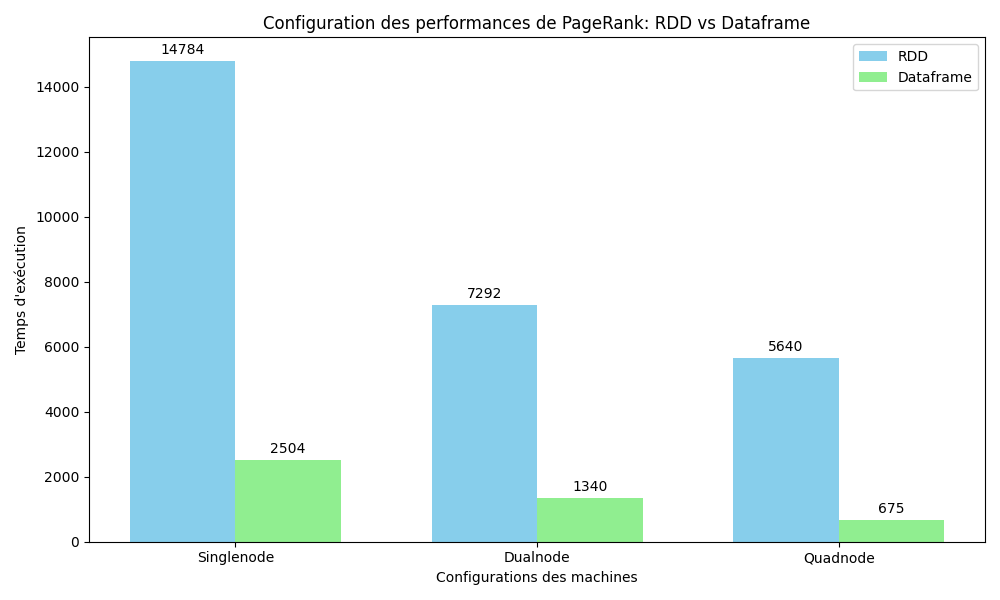

# Benchmark Spark : RDD vs SparkSQL

## Introduction
Ce projet a pour but de faire une analyse comparative entre **PySpark RDD** et **PySpark DataFrames**.
Pour ce faire, nous allons nous appuyer sur l'algorithme du **Page Rank** et comparer les deux implémentations sur le temps d'execution.

## Objectifs
Dans un premier temps, nous avons implémenter l'algorithme du Page Rank en RDD et en DataFrames.
Pour comparer ses deux implémentations, nous allons effectuer des tests sur différents configurations de cluster :
- 1 worker
- 2 worker
- 4 worker

## Données et code source
Le code source utilisé pour ce benchmark est disponible dans ce repo, vous pourrez trouver les exécutables dans les dossiers cluster_*XXX*_node
Les données sur lesquels nous avons effectuer ce test sont disponible sur *gs://public_lddm_data/*

## Plan d'expérimentation
Nous avons mesurer pour chaque algorithme le temps d'execution des 10 itération qui appliquent la formule du Page Rank aux différentes pages.
Nous avons executé ces algorithmes sur la plateforme GCP en utilisant l'outil Dataproc.
Les machines était dotée de 4 vCPU et de 12g de Mémoire.
La référence google cloud des machines est la suivante : n1-standard-4.

## Résultats et Analyse
La page avec le plus haut Page Rank de nos éxecution était [...](http://dbpedia.org/resource/Living_people) avec un page rank de 19320.8 pour l'algo SQL et de 86062.5 pour le RDD

Voici le graphique de comparaison entre RDD et DataFrame :

*Les données récoltées lors de ces experimentations sont disponibles dans le dossier ...*

### Discutions
Les résultats montrent que dataframe est significativement plus performant de RDD
Cela est du au fait que pour les dataframes, le calcul passe par un optimiseur.
On pourrait se questionner sur les améliorations que l'on pourrait apporter sur notre algorithme RDD pour améliorer son temps d'executions.

## Reproductibilité
Nos experiences sont reproductibles. Vous retrouverez dans le git, un dossier spécifique à l'éxecution des 2 algorithmes sur chaques cluster (1, 2 et 4 workers).
Dans les dossier vous retrouverez un script bash nommé avec un préfixe "run".
Veuillez spécifier vos propres informations (bucket, projectID, ...) si vous souhaitez réutiliser le script sur votre espace GCP.

## Crédits
Ce travail à été effectuer par **Henri COSSAIS** et **Mattéo Deransart**, étudiants en Master 2 d'Architecture Logicielle (ALMA) à Nantes Université
